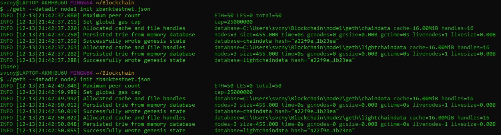
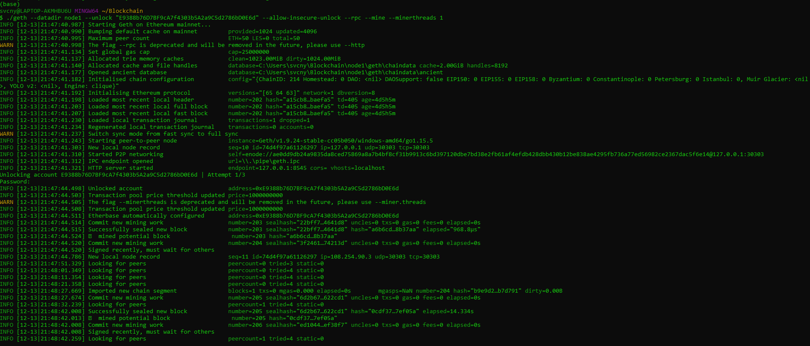
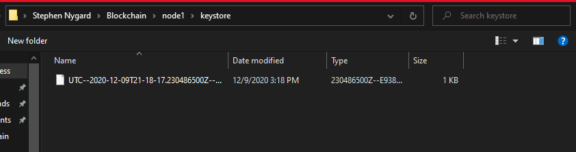
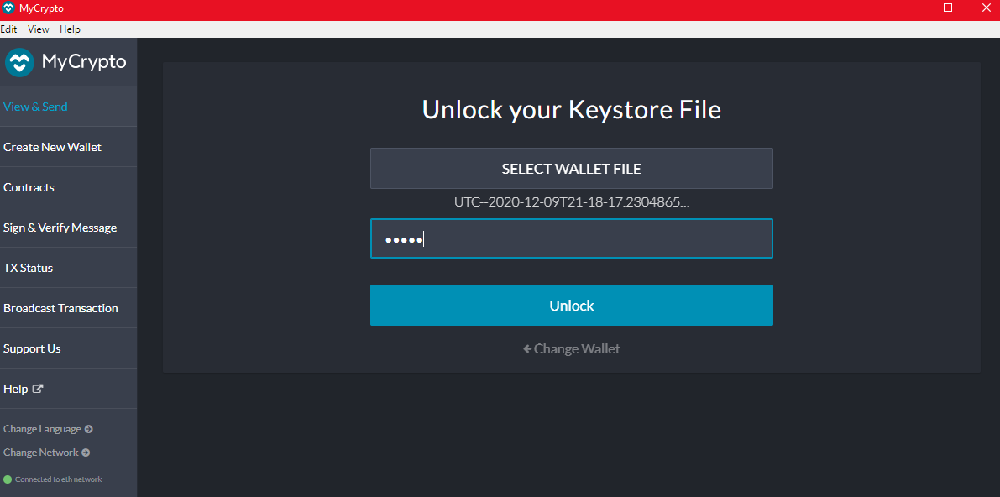
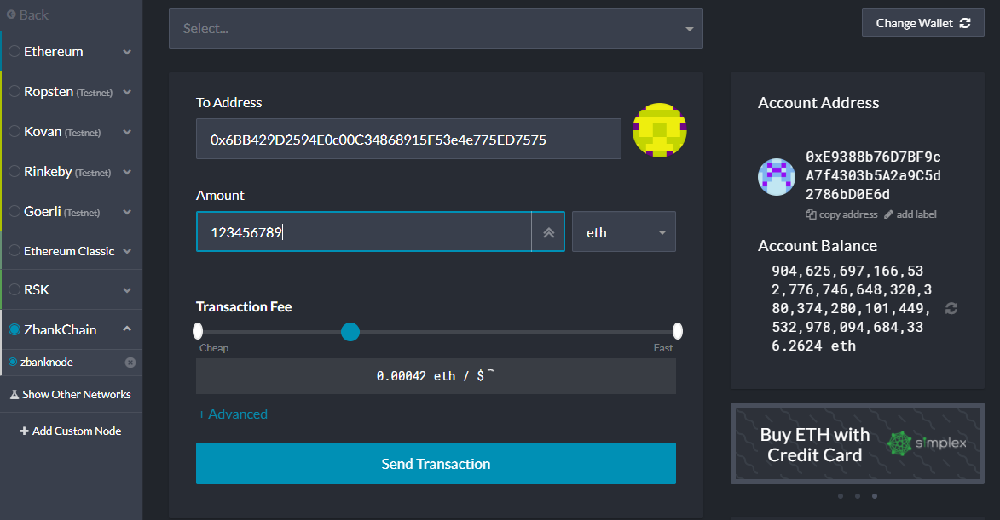
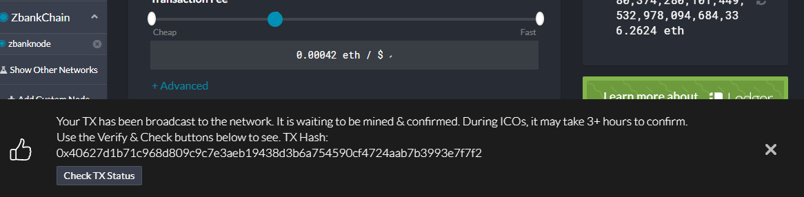
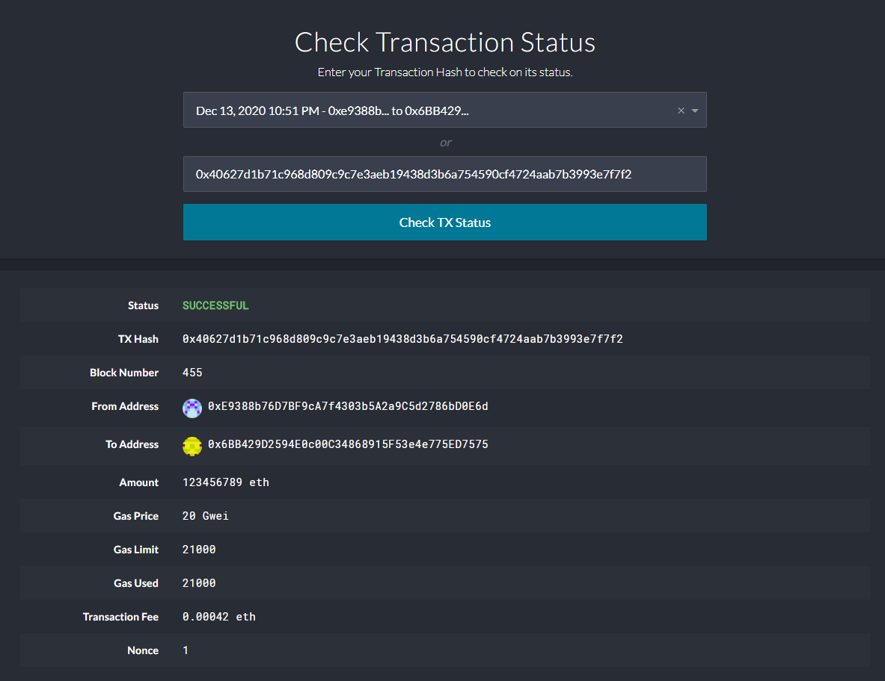

# Unit-18---Proof-of-Authority-Development-Chain

## ZBank Chain Test Network

These are instructions on how to initialize and use the zbankchain testnet created to explore the potential of use of blockchain at ZBank.

What is great is that the testnet can be experimented on offline and the tokens used have no real value.

The consensus algorithm used to develop the test network was Proof of Authority. Proof of Authority is a centralized system that allows only specific addresses to mine/produce blocks.

## Vision

The next steps would be to test using the Proof of Work consensus algorithm. Proof of work is the most popular algorithm because it is decentralized, and highly secure, and it uses real computing power and energy for blocks.  But unfortunately, that makes it more expensive in terms of resources.

### Requirements:

- Go Ethereum

- Puppeth

- Geth

- MyCrypto

## Setting up your environment

1. For Windows users you will need to download Go Ethereum. Navigate to the Go Ethereum Tools download page at https://geth.ethereum.org/downloads/. The version you download depends on if you're running 32 bit or 64 bit windows. Make sure you select Geth & Tools.

    - Installing in OS X requires you click on the "Geth & Tools 1.9.7" to download the applications bundle archive.

2. After downloading the tools archive, you will locate a file named geth-alltools-darwin-amd64-1.9.7-a718daa6.tar.gz in OS X, and a file called geth-alltools-windows-amd64-1.9.7-a718daa6.zip in Windows. Move the file to your base environment and rename 'Blockchain'.

3. Scroll down to the "Stable Releases" section and proceed depending on your operating system.

**If you are a Windows user, you must use git-bash as the terminal window to execute Go Ethereum commands.**

## Setting up MyCrypto

MyCrypto is a free, open-source interface for interacting with the block chain. 
1. The application download is located at https://download.mycrypto.com/.  You will be redirected to the appropriate application installer for your operating system. If you are not redirected, choose the appropriate installer.

2. Follow instructions in the installation Wizard.

    - For OS X users the first time you execute MyCrypto you will see a warning message. click 'Open' to start he application.

### If you need to add the application as an exception to your Mac OS security, perform the following:

1. Open the MyCrypto app, it should produce a warning error saying that you cannot open the application due to security reasons. Therefore, we'll need to make a security exception for it.

2. Look to the top-left of the screen and click on the Apple Logo and navigate to System Preferences > Security & Privacy.

## Configuring Network
1. From the directory, download the zbankchain.json file, and the node1 and node2 folders into your Blockchain folder. Once that is complete, you are now ready to configure the network.

2. Open your terminal window and cd into Blockchain.

3. You will now initialize your nodes. Initialize node1 by entering the following. From the data in gitbash, copy your enode to a notebook. You will use it to activate the nodes shortly.

        ./geth --datadir node1 init zbanktestnet.json

4. After, you will initialize node2 by entering the following:

        ./geth --datadir node2 init zbanktestnet.json

5. Now you will activate your nodes. Activate node1 by entering the following:

        ./geth --datadir node1 --unlock "E9388b76D7BF9cA7f4303b5A2a9C5d2786bD0E6d" --allow-insecure-unlock --rpc --mine --minerthreads 1

6. To initialize node2, you need to open a new terminal window. Copy your enode into the following command and enter it.

        ./geth --datadir node2 --unlock "6BB429D2594E0c00C34868915F53e4e775ED7575" --allow-insecure-unlock --port 30304 --bootnodes "enode://ae0dd9db24a9835da8ced75869a8a7b4bf8cf31b9913c6bd397120dbe7bd38e2fb61af4efdb428dbb430b12be838ae4295fb736a77ed56982ce2367dac5f6e14@127.0.0.1:30303" --ipcdisable --mine --minerthreads 1

7. Your blockchain is now activated! You will see data similar to the following in your terminal.

- Node 1:

- Node 2:

### Things to know:

- The blocktime is set to the default time of 15 seconds.

- The chain ID protects transactions and keeps them seperate from one another.  The chain ID is 214.

- The password used for both nodes is "admin".

## Connecting to MyCrypto

- A keystore is a file where private keys, certificates, etc. can be stored and is used to identify the user. It is located in the Blockchain file.
- You will use the keystore file for the testnet to login to MyCrypto.

    ### In MyCrypto:

    1. Select "Unlock your Keystore File"
    2. Navigate to the Blockchain folder. 
    3. Select the node you want to test send a transaction from, and open the keystore file. Enter the node password( which is "admin" for both). You are now ready to set up your network in MyCrypto.

### To set up your network:

1. Navigate to "Change Network" at the bottom of the left panel. 
2. Scroll to the bottom of the panel and select "+ Add Custom Node"
3. Enter "zbankchain" as your Node Name.
4. In the Network field, change the dropdown from ETH and scroll to the bottom of the menu to 'Custom'.
5. Enter "zbanknode" in Network Name field.
6. Select 'ETH' as the currency.
7. Enter 214 as the chain ID.
8. Enter http://127.0.0.1:8545 in the URL field
9. Hit 'Save & Use Custom Node'

**You are now ready to Send and Receive test coins!**

## Sending a transaction in MyCrypto

1. Log-in with the Keystore file (which contains your private key) and password.
2. Under Select choose 'Send Ether and Tokens'
3. Enter the address you want to send coins to (the node address not used to log in).
4. Check your balance. Enter the amount of Ethereum, and the fee you want to pay to send.

5. At the bottom of the page, you will see a link to check your transaction status and metadata that shows ETH, address, and fee information. 

## **To STOP the block chain hit CTRL + C in the terminal (once for each node) and the blockchain will deactivate.**